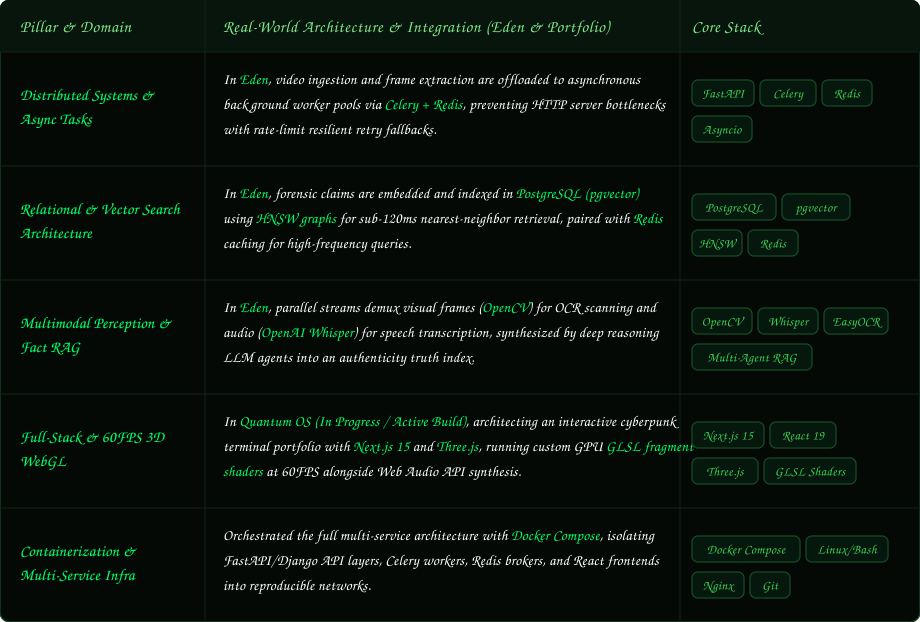
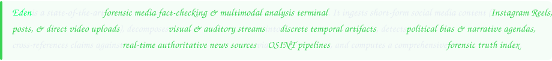

  <!-- Native Animated Cyberpunk GitHub Dark & Emerald Green Banner -->
  

  <!-- Real-Time Looping Iris Text Subtitle (GitHub Green) -->
  

  <!-- Unified Emerald Green Social Connect HUD -->
  

    &nbsp;&nbsp;&nbsp;&nbsp;
  

  

 

 

  

#### Eden Architectural Innovations

- **Multimodal Perception**: Synchronized **EasyOCR** (on-screen text localization) + **OpenAI Whisper** (temporal speech transcription) + **OpenCV** (4fps keyframe extraction)—watching video frames, reading on-screen captions, and transcribing spoken dialogue simultaneously to match words with visuals at exact seconds.
- **Political Agenda & Bias Analysis**: Quantifies narrative framing, manipulative bias, and partisan spin using specialized agentic LLM reasoning to detect whether content is pushing biased propaganda, one-sided spin, or intentional exaggeration instead of objective truth.
- **Real-Time OSINT News Verification**: Dynamically queries live news search APIs and cross-checks authoritative source evidence for every extracted assertion, instantly verifying claims against real-time breaking news and reputable journalism.
- **Dual-Path Fallback Orchestration**: Asynchronous task chaining via **Celery + Redis** with graceful degradation under API quota limits and GPU constraints, preventing server crashes and slowdowns during viral traffic spikes by queueing requests and rerouting through backup models.
- **Sub-120ms Vector Retrieval**: Forensic claim embeddings indexed in **PostgreSQL (pgvector)** with **HNSW graphs** for high-speed similarity search, scanning through massive databases of past claims and known hoaxes in under 120 milliseconds to find matching patterns.
- **Forensic Command HUD & Dossier**: Threat index telemetry, ⌘K command palette, and one-click PDF intelligence dossier generation with verifiable citations, packaging the entire forensic investigation into an exportable, shareable summary report with clickable proof links.
- **Infrastructure**: Fully containerized multi-container deployment with **Docker Compose**, **FastAPI / Django REST Framework**, and **React 18**, isolating APIs, database services, and frontend interfaces into self-contained Docker containers for consistent deployment anywhere.

**[Access Eden OSINT Pipeline & System Architecture →](https://github.com/Arnim-Zola/Eden)**

| Project & Domain | Architecture & Systems Highlights | Core Stack | Source Code |
| :--- | :--- | :--- | :--- |
| **CampusCart** `Campus Logistics` | Standing in a 40-person line at 8:55 AM just to print two pages before submission deadline? Absolutely not. CampusCart kills the campus queue forever with an instantaneous zero-queue utility powered by client-side **PDF.js** page parsing & dynamic pricing calculus, 3s automated polling queues via **Django REST**, and real-time vendor ticketing dashboards in **Next.js 14** + **PostgreSQL**. | `Next.js 14` `Django REST` `PostgreSQL` `PDF.js` | [Arnim-Zola/CampusCart](https://github.com/Arnim-Zola/CampusCart) |
| **Zemo** `E-Commerce Intel` | That "50% OFF Limited Deal" with 4.8 stars written by bots? We called its bluff. Zemo is an autonomous radar built to expose fake hype and predatory price hikes by automating headless **Playwright** scraping across dynamic DOMs, synthesizing 100+ raw customer reviews into structured sentiment vectors via **Meta Llama 3 8B**, and plotting historical price trends with **Plotly.js**. | `Python` `Playwright` `Meta Llama 3` `FastAPI` `Plotly.js` | [Arnim-Zola/Zemo](https://github.com/Arnim-Zola/Zemo) |
| **Brainiac** `Cognitive AI` | Ever wondered what 3 AM caffeine-fueled burnout actually looks like inside your head? Brainiac renders your brain's cognitive chaos into a living 3D simulation, featuring an interactive **@react-three/fiber** brain cortex mesh, computing 30-factor psychometric scoring vectors via **PyTorch**, and generating personalized AI improvement protocols. | `React 18` `@react-three/fiber` `Three.js` `FastAPI` `PyTorch` | [Arnim-Zola/Brainiac](https://github.com/Arnim-Zola/Brainiac) |
| **Quantum OS** `Interactive Portfolio` | Why should developer portfolios look like another generic resume template from 2015? Quantum OS turns my personal portfolio into a full-blown sci-fi cybernetic desktop operating system, powered by custom GPU **GLSL fragment shaders** locked at 60FPS, **Web Audio API** synthesis for real-time acoustic feedback, and a streaming edge AI terminal shell. | `Next.js 15` `React 19` `Three.js` `GLSL Shaders` `Web Audio` | [Arnim-Zola/Portfolio](https://github.com/Arnim-Zola/Portfolio) *(Active Build)* |

| System Domain | Core Technologies & Production Tooling |
| :--- | :--- |
| **Languages & Shaders** | `Python 3.11` `TypeScript` `JavaScript (ES6+)` `GLSL Shaders` `C++` `SQL` `Bash / Linux` |
| **Applied AI, Vision & NLP** | `Google Gemini 2.0` `Meta Llama 3 (8B)` `PyTorch` `OpenCV` `OpenAI Whisper` `EasyOCR` `pgvector (HNSW)` `LangChain` |
| **Distributed Backend & Scraping** | `FastAPI` `Django` `Django REST Framework` `Celery` `Redis` `Playwright` `RESTful APIs` |
| **Creative WebGL, 3D & Frontend** | `Next.js 15` `React 19` `Three.js` `@react-three/fiber` `Web Audio API` `Plotly.js` `PDF.js` `Tailwind CSS` |
| **Databases, DevOps & Media** | `PostgreSQL` `SQLite` `MongoDB` `Docker` `Docker Compose` `Git` `GitHub Actions` `FFmpeg` |

  <!-- GitHub Streak Stats (Obsidian & Emerald Neon Theme) -->
  
  
  <!-- GitHub Overall Stats (Obsidian & Emerald Neon Theme) -->
  

    

  <!-- Top Languages Card (Obsidian & Emerald Neon Theme) -->
  

  
<b>Engineered by Mohammed Sahil • 3rd Year CSE @ DSATM, Bengaluru</b>

  

