<div align="center">

  <!-- Native Animated Cyberpunk GitHub Dark & Emerald Green Banner -->
  <a href="https://github.com/Arnim-Zola">
    
  </a>

  <!-- Real-Time Looping Typing Subtitle (GitHub Green) -->
  <a href="https://github.com/Arnim-Zola/Eden">
    
  </a>

  <br/><br/>

  <!-- Status HUD Badges (GitHub Dark & Emerald Green) -->
  <p align="center">
    <a href="https://github.com/Arnim-Zola/Eden">
      
    </a>
    
    
  </p>

  <!-- Quick Social Connect Pills -->
  <p align="center">
    <a href="https://github.com/Arnim-Zola/Portfolio"></a>
    <a href="https://www.linkedin.com/in/mohammed-sahil-2b0583336/"></a>
    <a href="mailto:mohammedsahil0003@gmail.com"></a>
    <a href="https://leetcode.com/"></a>
    <a href="https://hackerrank.com/"></a>
    <a href="https://huggingface.co/Arnim-Zola"></a>
  </p>

</div>

---

### 🌿 PRIMARY FLAGSHIP: EDEN (Autonomous Misinformation Analysis Engine)

<div align="center">
  <a href="https://github.com/Arnim-Zola/Eden">
    
  </a>
</div>

<br/>

> **[Eden](https://github.com/Arnim-Zola/Eden)** is a state-of-the-art **forensic media fact-checking and multimodal analysis terminal**. It ingests short-form social media content (Instagram Reels, YouTube Shorts, direct video uploads), decomposes the visual and auditory streams into discrete temporal artifacts, and leverages deep reasoning LLM agents to detect deepfakes, verify assertions against authoritative live sources, and compute a forensic truth index.

```
┌─────────────────────────────────────────────────────────────────────────────┐
│                            EDEN MULTIMODAL PIPELINE                         │
├─────────────────────────────────────────────────────────────────────────────┤
│  [ Social Reels / Video Stream Ingestion (yt-dlp, Instaloader) ]            │
│                 │                                                           │
│                 ├──▶ [ OpenCV Frame Extraction ] ──▶ [ EasyOCR Text Scan ]  │
│                 │                                             │             │
│                 └──▶ [ Whisper Audio Slicer ]   ──▶ [ Transcribed Claims ]  │
│                                                               │             │
│                                           ▼                   ▼             │
│                 [ Cross-Modal Claim Synthesis & Temporal Alignment ]       │
│                                           │                                 │
│                                           ▼                                 │
│                 [ Multi-Agent RAG & Fact Verification Engine ]              │
│                                           │                                 │
│                                           ▼                                 │
│                 [ Comprehensive Truth Matrix & Authenticity Score % ]       │
└─────────────────────────────────────────────────────────────────────────────┘
```

#### ⚙️ Eden Architectural Innovations
- 👁️ **Multimodal Perception**: Synchronized **EasyOCR** (on-screen text/captions) + **OpenAI Whisper** (speech transcription) + **OpenCV** (keyframe sampling).
- 🧠 **Dual-Path Fallback Orchestraction**: Asynchronous task chaining via **Celery + Redis** with graceful degradation under API quota limits.
- 💻 **Forensic Command HUD**: Threat index telemetry, ⌘K command palette, and one-click PDF intelligence dossier generation.
- 🐳 **Infrastructure**: Fully containerized multi-container deployment with **Docker Compose**, **Django REST Framework**, and **React 18**.

👉 **[Explore Eden Source Code & Architecture →](https://github.com/Arnim-Zola/Eden)**

---

### 🚀 SECONDARY & SUPPORTING ARSENAL

| Project | Domain | Architecture & Highlights | Source Code |
| :--- | :--- | :--- | :--- |
| **CampusCart** 🛒 | Campus Logistics | Digital utility ecosystem for college printing & stationery; eliminates campus queues with **PDF.js** page cost estimation, automated 3s polling, and live admin ticketing. | [Arnim-Zola/CampusCart](https://github.com/Arnim-Zola/CampusCart) |
| **Zemo** ⚡ | E-Commerce Intelligence | Autonomous price tracking engine with headless **Playwright** scraping, **Meta Llama 3 8B** sentiment extraction on 100+ reviews, and **Plotly.js** trend graphs. | [Arnim-Zola/Zemo](https://github.com/Arnim-Zola/Zemo) |
| **Brainiac** 🧠 | Cognitive AI | Neuroscience-inspired cognitive analytics suite featuring interactive 3D **@react-three/fiber** brain maps, 30-factor psychometrics, and personalized AI improvement protocols. | [Arnim-Zola/Brainiac](https://github.com/Arnim-Zola/Brainiac) |
| **Quantum OS** 🌌 | 3D Interactive Web | Cyberpunk terminal operating system portfolio with Three.js WebGL shaders, live Gemini edge AI streaming, and custom sound synthesis. | [Arnim-Zola/Portfolio](https://github.com/Arnim-Zola/Portfolio) |

---

### 🏆 HACKATHONS, GDG & COMPETITIVE ARENA

| Event / Hackathon | Organization / Track | Achievement / Honor | Focus & Solution |
| :--- | :--- | :--- | :--- |
| **HackBangalore 2025** | AWS & Bengaluru Dev Collective | 🥇 **1st Place Grand Winner (₹1,00,000)** | Distributed multi-agent orchestrator with self-healing tools |
| **Flipkart GRiD 6.0** | Flipkart Robotics & Vision | 🎯 **National Finalist (Rank 142 / 12,000+)** | Real-time YOLOv8 + TensorRT edge camera sorting pipeline |
| **Smart India Hackathon (SIH)** | Ministry of Education & AICTE | 🛡️ **National Grand Finalist** | Edge-accelerated 3D spatial sign language translator |
| **Bengaluru GenAI Buildathon** | Scaler & Google Cloud Community | 🥉 **2nd Runner-Up & Best Architecture** | Sub-100ms vector search & hybrid lexical retrieval |
| **GDG Bengaluru Sprint** | Google Developer Groups | ⚡ **Top Build Prototype** | Autonomous agentic workflow tooling & LLM integrations |

---

### ⚡ TECHNICAL ARSENAL

<div align="center">

| Category | Technologies & Tools |
| :--- | :--- |
| **Languages** | `Python 3.11` `TypeScript` `JavaScript (ES6+)` `C++` `SQL` `HTML5` `CSS3` |
| **AI / ML & Vision** | `PyTorch` `OpenCV` `OpenAI Whisper` `EasyOCR` `Google Gemini` `Meta Llama 3` `LangChain` `pgvector` `FAISS` |
| **Web & Frameworks** | `Next.js` `React 19` `FastAPI` `Django` `Express.js` `Node.js` `Three.js` `@react-three/fiber` `Tailwind CSS` |
| **Databases & Queues** | `PostgreSQL` `MongoDB` `Redis` `Celery` `Firebase` `SQLite` |
| **DevOps & Media Tools** | `Docker` `Docker Compose` `Git` `GitHub Actions` `FFmpeg` `Playwright` `yt-dlp` `Linux` |

</div>

---

### 💼 CAREER TRAJECTORY & EXPERIENCE

```yaml
Current Role:
  Position: "Founding AI & Systems Intern"
  Company:  "Stealth GenAI Startup — Bengaluru"
  Focus:    "Sub-120ms RAG pipelines (pgvector, FAISS, FastAPI) & autonomous agent execution"

Previous:
  Position: "Computer Vision & Edge AI Lead"
  Lab:      "Autonomous Systems Lab"
  Focus:    "TensorRT & YOLOv8 on NVIDIA Jetson edge boards (40+ FPS); Sensor fusion"

Open Source & Mentorship:
  Role:     "Core Contributor & Build Sprint Mentor"
  Guild:    "Bengaluru FOSS Community"
  Impact:   "Mentored 150+ builders across hackathons; Authored developer benchmarking tools"
```

---

### 📊 REAL-TIME TELEMETRY & CODING STATS

<div align="center">

  <!-- GitHub Streak Stats (GitHub Dark & Green Theme) -->
  
  
  <!-- GitHub Overall Stats (GitHub Dark & Green Theme) -->
  

  <br/><br/>

  <!-- Top Languages Card (GitHub Dark & Green Theme) -->
  

</div>

---

<div align="center">
  <p><b>⚡ Engineered by Mohammed Sahil • 2nd Year CSE @ DSATM, Bengaluru ⚡</b></p>
  
</div>
