

  <!-- Native Animated Cyberpunk GitHub Dark & Emerald Green Banner -->
  

  <!-- Real-Time Looping Iris Text Subtitle (GitHub Green) -->
  

  <!-- Unified Emerald Green Social Connect HUD -->
  

    &nbsp;&nbsp;&nbsp;&nbsp;
  

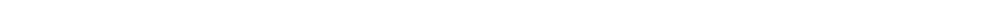

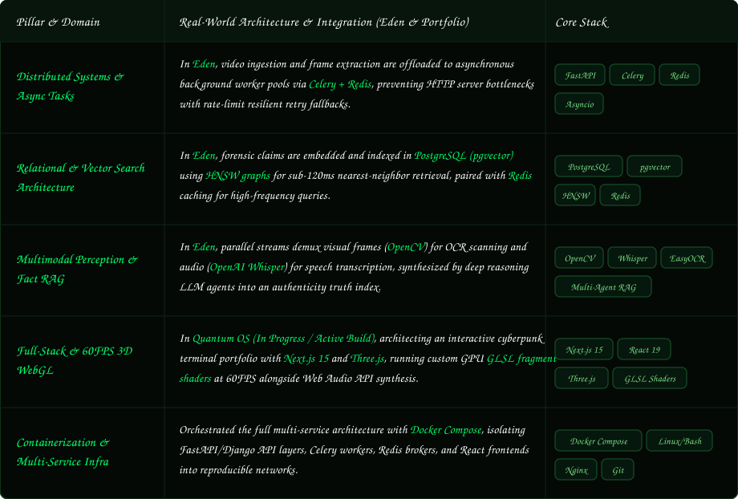

  

 

 

  

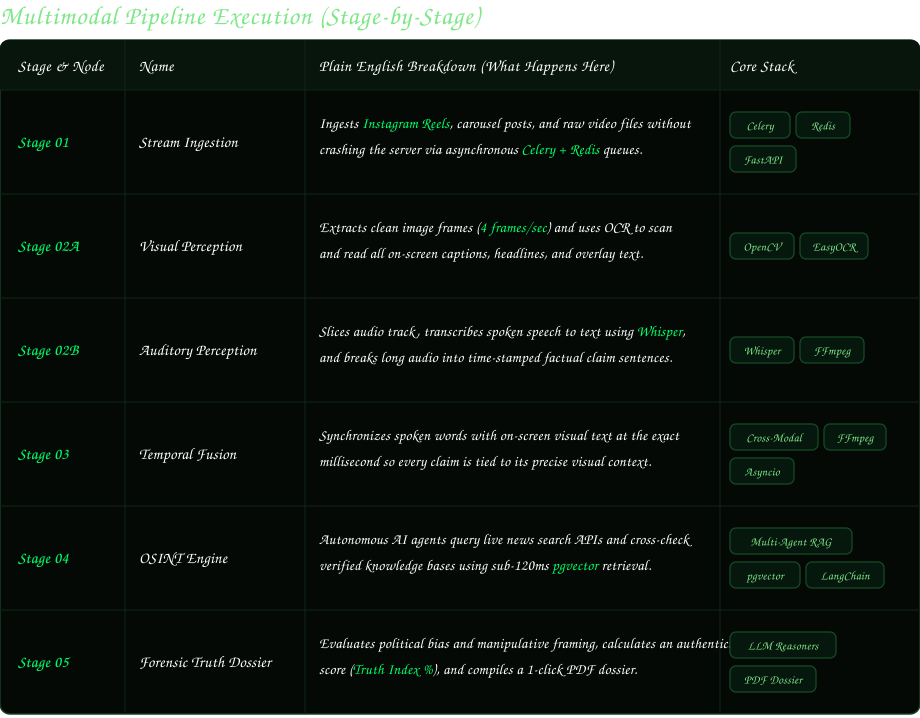

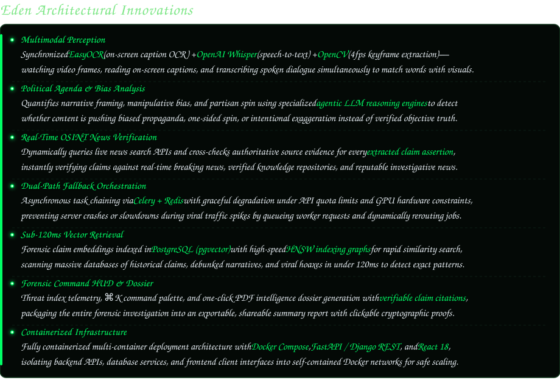

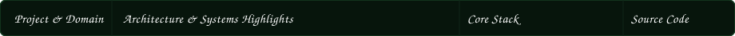
<a href="https://github.com/Arnim-Zola/CampusCart">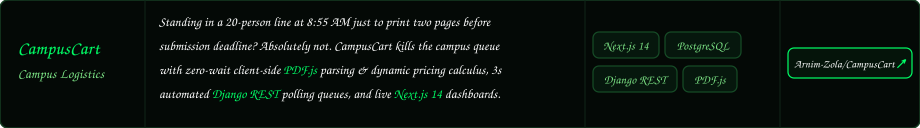</a>
<a href="https://github.com/Arnim-Zola/Zemo">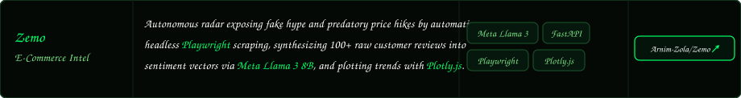</a>
<a href="https://github.com/Arnim-Zola/Brainiac">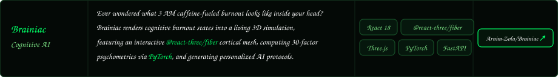</a>
<a href="https://github.com/Arnim-Zola/Portfolio">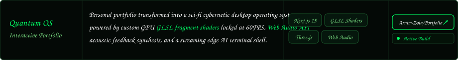</a>

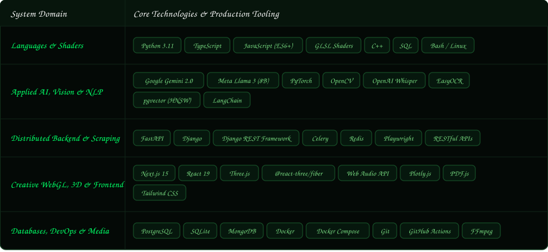

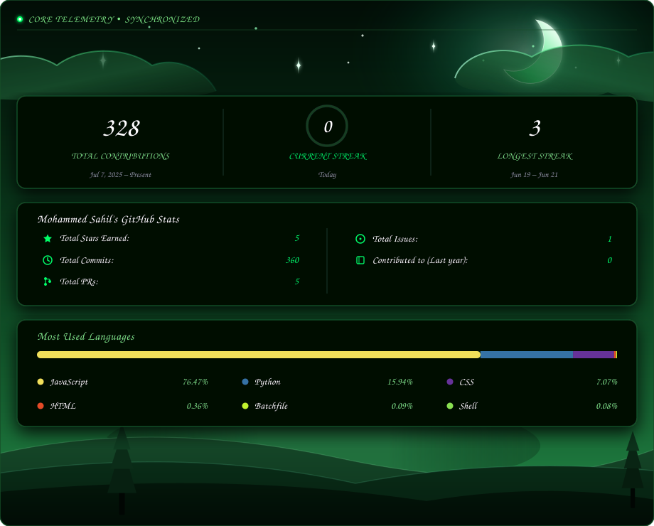

  
<b>Engineered by Mohammed Sahil • 3rd Year CSE @ DSATM, Bengaluru</b>

  

